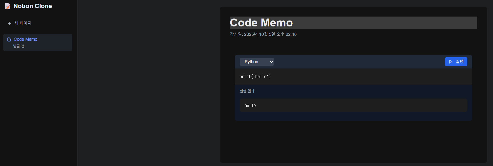

# 📝 Notion Clone - 코드 실행 가능한 노트 플랫폼

노션과 같은 블로그, 메모, 프로젝트 관리 기능에 **코드 실행 기능**을 추가한 올인원 플랫폼입니다.

## ✨ 주요 기능

- **📄 블록 기반 에디터**: 노션 스타일의 직관적인 편집 경험
- **💻 코드 실행**: JavaScript, Python, Java, C++, Go, Rust 등 다양한 언어 실행
- **🎨 마크다운 지원**: 텍스트, 헤딩, 리스트, 코드 블록 등
- **📁 페이지 관리**: 여러 페이지 생성 및 관리
- **💾 데이터 저장**: Prisma + SQLite로 데이터 영구 저장
- **🎯 실시간 피드백**: 코드 실행 결과 즉시 확인

## 🛠️ 기술 스택

### Frontend
- **Next.js 15** - React 프레임워크
- **TypeScript** - 타입 안정성
- **Tailwind CSS** - 유틸리티 기반 스타일링
- **TipTap** - 리치 텍스트 에디터
- **React Hot Toast** - 알림 메시지

### Backend
- **Next.js API Routes** - 서버리스 API
- **Prisma** - ORM (Object-Relational Mapping)
- **SQLite** - 로컬 데이터베이스

### Code Execution
- **Piston API** - 안전한 샌드박스 환경에서 코드 실행

## 🚀 시작하기

### 1. 의존성 설치

\`\`\`bash
cd notion-clone
npm install
\`\`\`

### 2. 데이터베이스 설정

\`\`\`bash
npx prisma generate
npx prisma db push
\`\`\`

### 3. 개발 서버 실행

\`\`\`bash
npm run dev
\`\`\`

브라우저에서 [http://localhost:3000](http://localhost:3000)을 열어 확인하세요.

## 📦 프로젝트 구조

\`\`\`
notion-clone/
├── app/
│   ├── api/
│   │   └── execute/          # 코드 실행 API
│   ├── globals.css           # 전역 스타일
│   ├── layout.tsx            # 루트 레이아웃
│   └── page.tsx              # 메인 페이지
├── components/
│   ├── Editor.tsx            # 메인 에디터 컴포넌트
│   ├── CodeExecutor.tsx      # 코드 실행 컴포넌트
│   └── Sidebar.tsx           # 사이드바 네비게이션
├── lib/
│   └── prisma.ts             # Prisma 클라이언트
├── prisma/
│   ├── schema.prisma         # 데이터베이스 스키마
│   └── dev.db                # SQLite 데이터베이스
└── package.json
\`\`\`

## 🎯 사용 방법

### 페이지 생성
1. 좌측 사이드바에서 "새 페이지" 버튼 클릭
2. 페이지 제목 입력
3. 에디터에서 자유롭게 내용 작성

### 코드 작성 및 실행
1. 페이지 하단의 "코드 실행기" 섹션으로 이동
2. 언어 선택 (JavaScript, Python, Java, C++, Go, Rust)
3. 코드 작성
4. "실행" 버튼 클릭
5. 실행 결과 확인

### 지원 언어 예시

**JavaScript**
\`\`\`javascript
console.log("Hello, World!");
\`\`\`

**Python**
\`\`\`python
print("Hello, World!")
\`\`\`

**Java**
\`\`\`java
public class Main {
    public static void main(String[] args) {
        System.out.println("Hello, World!");
    }
}
\`\`\`

## 🔧 주요 명령어

\`\`\`bash
# 개발 서버 실행
npm run dev

# 프로덕션 빌드
npm run build

# 프로덕션 서버 실행
npm start

# Prisma Studio 실행 (데이터베이스 GUI)
npx prisma studio
\`\`\`

## 📚 데이터베이스 스키마

- **User**: 사용자 정보
- **Page**: 페이지 (제목, 내용, 메타데이터)
- **Block**: 페이지 내 블록 (텍스트, 코드, 이미지 등)
- **CodeExecution**: 코드 실행 히스토리

## 🌟 향후 계획

- [ ] 사용자 인증 (NextAuth.js)
- [ ] 실시간 협업 (Socket.io / Yjs)
- [ ] 파일 업로드 및 이미지 삽입
- [ ] 페이지 공유 및 권한 관리
- [ ] 다크 모드
- [ ] 모바일 반응형 개선
- [ ] 코드 실행 히스토리 저장
- [ ] 코드 공유 기능
- [ ] 팀 워크스페이스

## 🤝 기여하기

이슈와 풀 리퀘스트를 환영합니다!

## 📄 라이선스

MIT License

---

